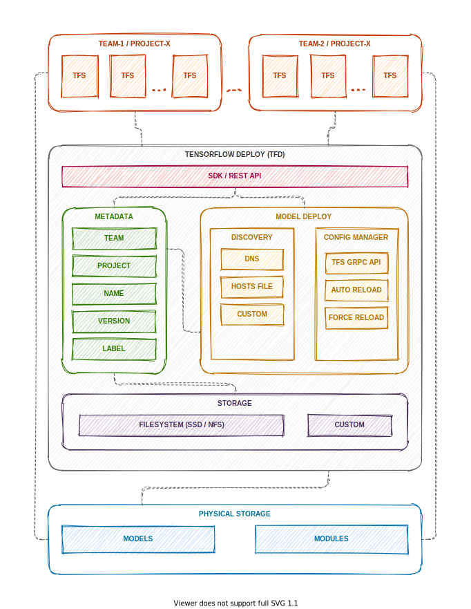

<div align="center">
  
</div>
<br />


TensorFlow Deploy (briefly: `tfd`) is a storage, versioning and model management service created in [TensorFlow](https://www.tensorflow.org) (`tf`) and compliant with [TensorFlow Serving](https://www.tensorflow.org/serving) (`tfs`). Its main objective is to simplify the process of a model going into production environment to the maximum - a data scientist is to focus on producing high quality tested models instead of devops. Additionally, `tfd` strongly integrates with `tfs` and allows to utilize even the most advanced functionalities. Another key fact is that not only models, but also `tf` modules compliant with [TensorFlow Hub](https://www.tensorflow.org/hub) (`tfh`) can be stored in the service.

Some of the key features:

* Implementing models into production with one command
* Easy communication with a dedicated `tensorflow-deploy-utils` package or via REST API
* Model tagging and versioning (easy A/B test operation)
* Possibility of running simultaneous projects for a number of teams
* Possibility of storing and versioning personal `tf` modules compliant with `tfh`
* Ready to use in a distributed environment based on [Kubernetes](https://www.kubernetes.io) - a docker image is available on [DockerHub](https://hub.docker.com/repository/docker/grupawp/tensorflow-deploy)

*TensorFlow, the TensorFlow logo and any related marks are trademarks of Google Inc.*

# Project principles/philosophy/architecture

**Please note** we had to make one assumption while creating the architecture in order to be able to fully use the `tfd` functionalities. We have to stick to specific terminology and name `tfs` workers accordingly while creating our models/modules. This allows easy access and keeping implementation neat and tidy even in big companies managing multiple teams working on numerous projects and creating hundreds of models on a daily basis. By conducting a few months' tests of such solution in our internal production, we were able to test its both scalability and stability.


Being to the point, whilst creating a certain model we have to make sure it has a unique id consisting of three parameters: `team`, `project`, `name`. Namely:

* TEAM - it is the name of the team where you run projects aiming at creating one or many models
* PROJECT - it is the name of the project where you create one or many models
* NAME - it is the name of the model which you want to implement into production environment. A single model can have many versions and some of them may be live simultaneously thanks to labels (which this will be covered a bit further).


Also, specific terminology applies to `tfs` workers which will serve models created by data scientists. The rule here is as follows:

`tfs-TEAM-PROJECT`

which means that one `tfs` instance can have many models (and their versions) assigned to a specific team and project. In case of performance issues, another copy can be easily run on kubernets.

## Overview




# Create, implement and serve the model in less than 60 seconds

```bash
# Download the tensorflow-deploy service repository
# Linux:
git clone https://github.com/grupawp/tensorflow-deploy.git
# on Windows - if a problem occurs (message in logs "no such file or directory" when building program) due to difference in line break (EOL) characters on Windows and Linux:
git clone https://github.com/grupawp/tensorflow-deploy.git --config core.autocrlf=false
# Go to the catalogue containing examples
cd tensorflow-deploy/demo
# Run the pre-defined jupyter notebook environment by using docker-compose - it may take a moment if you are doing it for the first time
docker-compose up
# Click the jupyter notebook link
# Run notebook 1_tfd_introduction.ipynb and then the remaining ones if you would like to discover all tfd functionalities
```

## Usage
There are two ways of communicating with the service. We can either use [curl](https://curl.haxx.se) or [httpie](https://httpie.org) tools, or, which is most recommended, use a ready-to-go package written in python and available on pypi [tensorflow-deploy-utils](https://pypi.org/project/tensorflow-deploy-utils/)

In order to use a ready-to-go package, we always need to initiate TFD class first.

```python
import tensorflow_deploy_utils as tfd

tfd_cursor = tfd.TFD(YOUR_TEAM, YOUR_PROJECT, YOUR_MODEL_NAME)
# you can now proceed with your further operations
```

##### Model deploy
```python
tfd_cursor.deploy_model(PATH_TO_YOUR_MODEL)
```

##### Available model check
```python
print(tfd_cursor.list_models())  # lists all the models
print(tfd_cursor.list_models(team=YOUR_TEAM))  # lists all the models for a specific team
print(tfd_cursor.list_models(project=YOUR_PROJECT))  # lists all the models for a specific project (if there are two teams that have named their projects identically, both of them will be visible)
print(tfd_cursor.list_models(team=YOUR_TEAM, project=YOUR_PROJECT))  # lists all the models for a certain team and a certain project
# analogically, we can search by model's name and label
```

# Documentation

The easiest way of using TensorFlow Deploy is with Docker image.

* [Install TensorFlow Deploy using Docker](Docs/install-using-docker.md)
  * [TensorFlow Deploy as a Model Repository](Docs/install-using-docker.md#TensorFlow-Deploy-as-a-model-repository)
  * [TensorFlow Deploy as a Deployment Tool](Docs/install-using-docker.md#TensorFlow-Deploy-as-a-deployment-tool)
* [Configure TensorFlow Deploy](Docs/configuration.md)
  *  Configure via [ENVS](Docs/configuration-envs.md)
  *  Configure via [CLI](Docs/configuration-cli.md)
  *  Configure via [YAML File](Docs/configuration-yaml.md)
* [Communicate using REST API](Docs/api.md)
  *  [Common Endpoints](Docs/api-common.md)
  *  [Models Endpoints](Docs/api-models.md)
  *  [Modules Endpoints](Docs/api-modules.md)


# About us
We are a team responsible for the security of mailbox systems of Wirtualna Polska Media S.A., which is the biggest mailbox system in Poland. Each month, we observe over 10 000 000 hits from individual users with the average of around 3000 hits and 1700 mails per second. At peak times, these numbers get as high as 10 000 hits or mails each second. Each hit as well as mail has to be verified by a number of our security systems in order to provide our users with maximum protection. Therefore, every solution that we create has to be absolutely efficient and scalable.

# Credits
TFD logo: [Maciej Żelaznowski](https://dribbble.com/zelaznowski)\
Translations: [Kamil Dolata](mailto:kdolata1989<at>gmail.com)